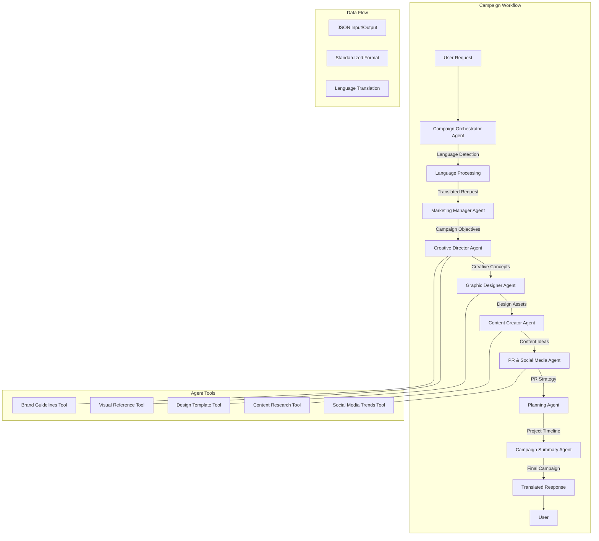

# Agentic Marketing Campaign System

## Overview

This repository contains a collection of JSON workflow templates for an advanced agentic marketing campaign system built on n8n. The system orchestrates specialized AI agents to create comprehensive marketing campaigns following a structured sequence with proper data validation and multi-language support.

## System Architecture

The campaign workflow system uses a sophisticated multi-agent approach where specialized AI agents collaborate to create a complete marketing campaign. Each agent has specific expertise and responsibilities, with data flowing seamlessly between them in standardized JSON formats.

### Architecture Diagram



### Agent Descriptions

1. **Campaign Orchestrator Agent**

   - Coordinates the entire campaign creation process
   - Detects language of user requests and ensures responses match
   - Translates between user language and internal English processing
   - Validates inputs and outputs at each stage

2. **Marketing Manager Agent**

   - Defines campaign objectives and target audience
   - Establishes strategic goals and key messaging
   - Creates product positioning and market analysis
   - Identifies competitive advantages and market opportunities

3. **Creative Director Agent**

   - Develops creative concepts and brand positioning
   - Establishes visual identity guidelines
   - Uses specialized tools for brand guidelines and visual references
   - Creates cohesive creative direction across all channels

4. **Graphic Designer Agent**

   - Creates visual mockups and design specifications
   - Develops color palettes, typography, and layout guidelines
   - Produces channel-specific design assets
   - Ensures visual consistency with brand guidelines

5. **Content Creator Agent**

   - Develops platform-specific content ideas
   - Creates copy suggestions and content calendars
   - Ensures messaging consistency across channels
   - Optimizes content for different platforms and audiences

6. **PR and Social Media Agent**

   - Handles media outreach strategy
   - Creates press release templates
   - Develops social media content and engagement tactics
   - Plans events and promotional activities

7. **Planning Agent**

   - Creates detailed project timelines
   - Assigns tasks to appropriate team members
   - Establishes milestones and deadlines
   - Ensures efficient resource allocation

8. **Campaign Summary Agent**
   - Synthesizes all agent outputs into a comprehensive campaign
   - Translates final deliverables back to user's language
   - Formats the campaign into a structured, professional document
   - Ensures all components work together cohesively

## Template Files

The repository includes the following JSON template files:

- `Campaign_Agentic.json`: The main workflow that orchestrates all agents
- `Agent___Market_Manager.json`: Specialized agent for marketing strategy
- `Agent___Creative_Director.json`: Specialized agent for creative direction
- `Agent___Graphic_Designer.json`: Specialized agent for visual design
- `Agent___Content_Creator.json`: Specialized agent for content creation
- `Agent___PR_and_Social_Content.json`: Specialized agent for PR and social media

## Key Features

- **Multi-language Support**: Detects the language of user requests and responds in the same language
- **Comprehensive Campaign Planning**: Creates complete marketing campaigns with all necessary components
- **Specialized Agent Roles**: Each agent focuses on a specific aspect of the campaign
- **Structured Output**: All agents produce standardized JSON outputs for seamless integration
- **Visual Asset Creation**: Includes mockups and design specifications for various channels
- **Content Strategy**: Develops platform-specific content ideas and posting schedules
- **Project Timeline**: Creates detailed project timelines with task assignments
- **Modular Architecture**: Easily extensible with additional specialized agents
- **Tool Integration**: Specialized tools augment agent capabilities

## Technical Implementation

The system is built on n8n workflow automation platform and leverages several key technologies:

- **OpenAI GPT-4o**: Powers the natural language understanding and generation capabilities
- **JSON Data Exchange**: Standardized format for communication between agents
- **Language Detection**: Automatically identifies input language and responds accordingly
- **Specialized Tools**: Each agent has access to domain-specific tools (brand guidelines, visual references, etc.)
- **Asynchronous Processing**: Agents can work in parallel when dependencies allow
- **Error Handling**: Robust validation at each stage ensures data integrity

## Usage

These templates are designed to be imported into n8n, a workflow automation platform. To use them:

1. Import the template files into your n8n instance
2. Configure the OpenAI API credentials for the language models
3. Trigger the main workflow with a marketing campaign request
4. The system will process the request through all specialized agents
5. Review the comprehensive campaign output

## Example Input

The system accepts marketing campaign requests in any language. A typical request might include:

- Product name and description
- Target market and pricing
- Key product features and benefits
- Target audience demographics
- Marketing budget and timeline
- Desired marketing channels
- Campaign objectives

## Output

The system produces a comprehensive marketing campaign that includes:

1. **Executive Summary**: Overview of the entire campaign
2. **Campaign Strategy**: Product overview, target audience, key messaging
3. **Creative Direction**: Creative concepts, visual identity, design elements
4. **Content Strategy**: Content themes, platform-specific approaches, examples
5. **Channel Strategy**: Channel mix, platform-specific tactics, posting schedule
6. **PR Strategy**: Media outreach, event planning, press materials
7. **Budget Allocation**: Cost breakdown, ROI projections
8. **Implementation Roadmap**: Timeline, key milestones, team responsibilities
9. **Success Metrics**: KPIs, measurement methodology

## Implementation Example

Here's a simplified example of how data flows through the system:

```json
// User Request (any language)
{
  "request": "Create a marketing campaign for our new eco-friendly water bottle"
}

// Campaign Objectives (from Marketing Manager)
{
  "product_overview": "Eco-friendly reusable water bottle",
  "target_audience": "Environmentally conscious consumers, 25-45",
  "key_messaging": ["Sustainable", "Durable", "Stylish"],
  "campaign_goals": ["Increase brand awareness", "Drive online sales"]
}

// Creative Concepts (from Creative Director)
{
  "brand_positioning": "Premium eco-friendly lifestyle product",
  "visual_identity": {
    "color_palette": ["#4CAF50", "#2196F3", "#FFFFFF"],
    "typography": "Clean, modern sans-serif",
    "imagery_style": "Active outdoor lifestyle with natural elements"
  }
}

// Final Output (translated back to user's language)
// Comprehensive campaign with all components
```

## Requirements

- n8n workflow automation platform (v0.214.0 or higher)
- OpenAI API access (GPT-4o model)
- Google Drive integration (for document storage)
- Minimum 4GB RAM for workflow execution

## Future Enhancements

- Integration with design tools (Figma, Adobe Creative Cloud)
- Enhanced visual asset generation using DALL-E or Midjourney
- Real-time collaboration features
- Campaign performance analytics
- A/B testing capabilities

## License

This project is proprietary and confidential. Unauthorized copying, distribution, or use is strictly prohibited.

---

_Created and maintained by K. Tanapol Anantachaiwanich_

_Last updated: March 26, 2025_
